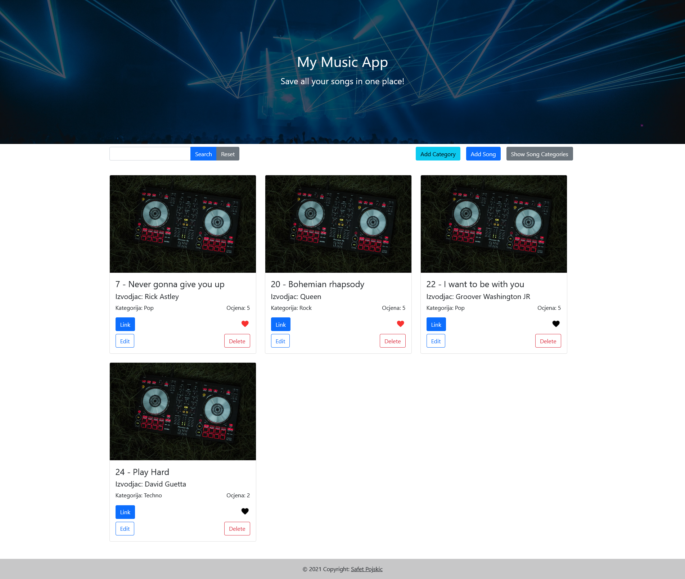
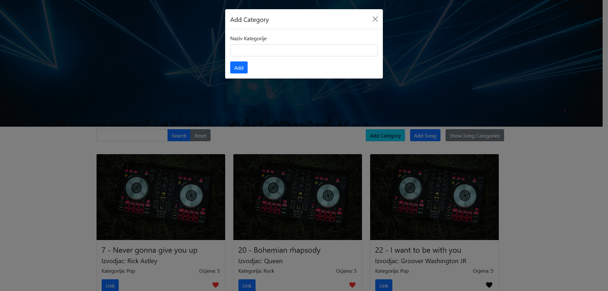
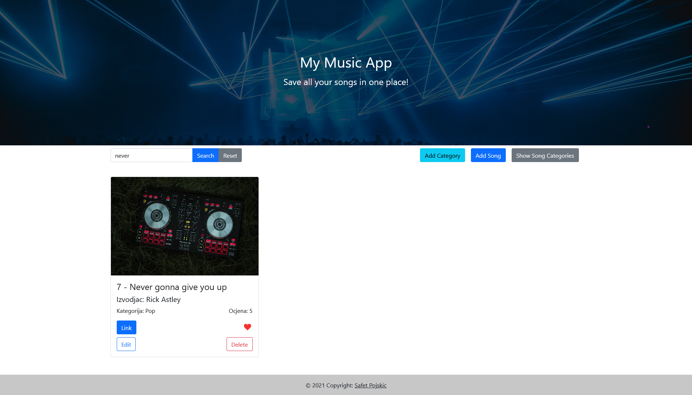

<div id="top"></div>

<!-- PROJECT LOGO -->
<br />
<div align="center">
  


  <h3 align="center">My Music App</h3>

  <p align="center">
    Project that will help you with saving all your music in one place!
  </p>
</div>


<!-- TABLE OF CONTENTS -->
<details>
  <summary>Table of Contents</summary>
  <ol>
    <li>
      <a href="#about-the-project">About The Project</a>
      <ul>
        <li><a href="#built-with">Built With</a></li>
      </ul>
    </li>
    <li>
      <a href="#getting-started">Getting Started</a>
      <ul>
        <li><a href="#prerequisites">Prerequisites</a></li>
        <li><a href="#installation">Installation</a></li>
      </ul>
    </li>
    <li><a href="#usage">Usage</a></li>
  </ol>
</details>


<!-- ABOUT THE PROJECT -->
## About The Project

This is a project built for saving all your music in one place. You can add categories, add songs, delete, and edit songs!
 <br />
 
 ### Root directory layout

    .
    ├── client   
    ├── server
    └── README.md
    

<p align="right">(<a href="#top">back to top</a>)</p>


### Built With

* [Angular](https://angular.io/)
* [Bootstrap](https://getbootstrap.com/)
* [.NET 6](https://nodejs.org/en/)

<p align="right">(<a href="#top">back to top</a>)</p>


<!-- GETTING STARTED -->
## Getting Started

### Prerequisites

Install NPM
* npm
  ```sh
  npm install npm@latest -g
  ```

### Preparation


3. Clone the repo
   ```sh
   git clone https://github.com/MagicPojska/my-music-app.git
   ```
5. Install NPM packages in client folder
   ```sh
   npm install
   ```
7. Open server folder in Visual Studio 2022 and start the server
7. Start client
   ```sh
   ng serve --open
   ```

<p align="right">(<a href="#top">back to top</a>)</p>


<!-- USAGE EXAMPLES -->
## Usage

Welcome page


List categories:


Add song:


Add category:


Search songs



<p align="right">(<a href="#top">back to top</a>)</p>


<!-- CONTACT -->
## Contact

Safet Pojskić - pojskicsafet@gmail.com
